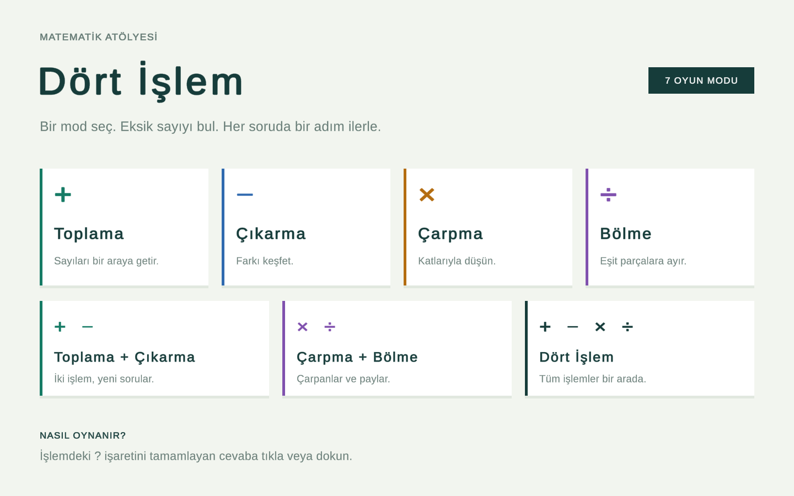
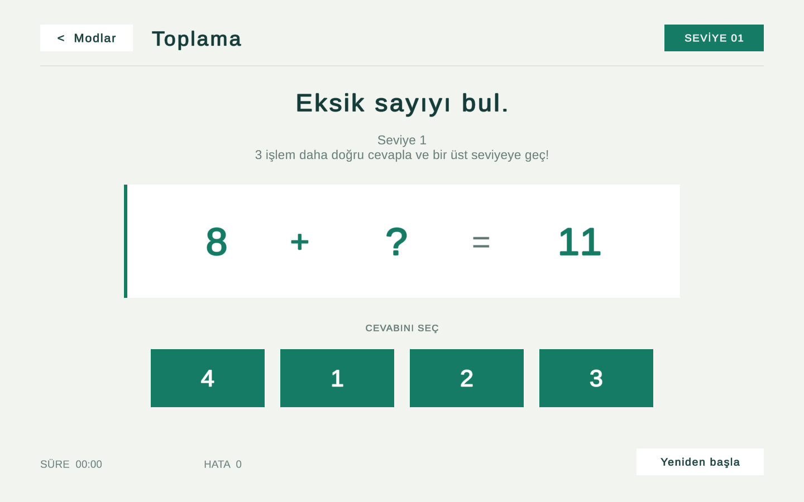
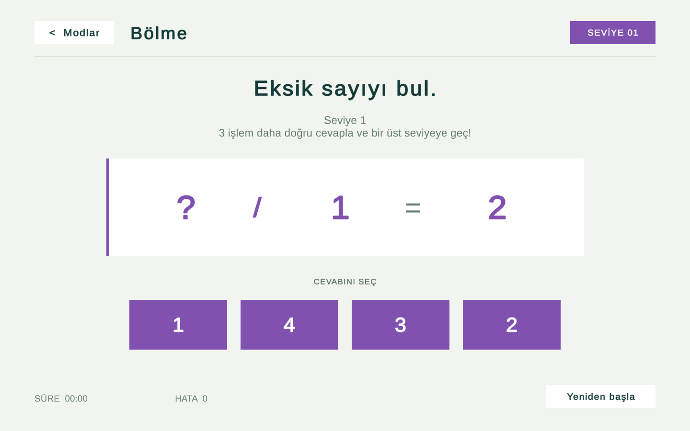
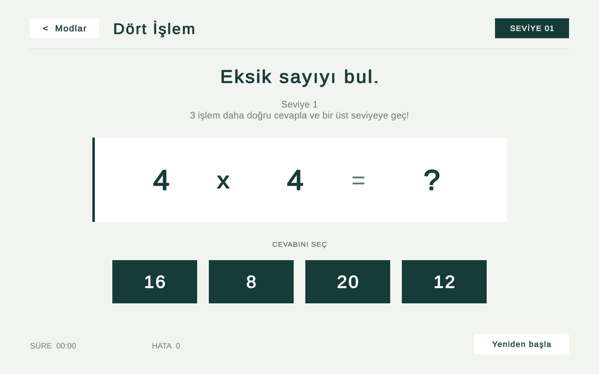

# Dört İşlem

Unity ve C# ile geliştirilmiş, yedi farklı modda eksik sayıyı bulmaya dayanan matematik oyunu. Oyuncu, işlemdeki soru işaretini tamamlayan cevabı seçerek seviyeler boyunca ilerler.

**Oyun tasarımı ve geliştirme: [Ufuk Bayhan](https://github.com/UfukBayhan)**

## Oynanış

Her soruda bir işlemin bir terimi veya sonucu gizlenir. Dört seçenek arasından doğru sayıyı seçin. Doğru cevaplar seviye hedefine ilerletir; yanlış cevaplar hata sayacına eklenir ve aynı soruyu tekrar denemenize izin verir. Başlangıçta üç doğru cevapla sonraki seviyeye geçilir. İlerleyen seviyelerde soru aralıkları ve hedefler değişir.

- Yedi mod arasında geçiş sağlayan başlangıç ekranı.
- İşleme göre üretilen sorular ve yanıltıcı cevap seçenekleri.
- Seviye ilerlemesi, süre ve hata takibi.
- Doğru ve yanlış cevaplar için görsel ve sesli geri bildirim.
- Yeniden başlatma ve mod seçim ekranına dönüş.
- Farklı pencere boyutlarına uyarlanan Unity UI arayüzü.

## Oyun modları

| Mod | İşlemler |
| --- | --- |
| Toplama | + |
| Çıkarma | − |
| Çarpma | × |
| Bölme | ÷ |
| Toplama + Çıkarma | +, − |
| Çarpma + Bölme | ×, ÷ |
| Dört İşlem | +, −, ×, ÷ |

## Oyun içi görüntüler

Görüntüler çalışan Windows sürümünden alınmıştır.

### Toplama

### Bölme

### Dört İşlem

## Unity ile çalıştırma

1. Repoyu klonlayın veya ZIP olarak indirin.
2. Unity Hub üzerinden proje klasörünü ekleyin.
3. **Unity 6000.3.9f1** ile açıp paketlerin içe aktarılmasını bekleyin.
4. Project panelinde `Assets/Game/Scenes/ModeSelect.unity` sahnesine çift tıklayın.
5. **Play** düğmesine basın ve bir oyun modu seçin.

Unity boş bir `Untitled` sahnesiyle açılırsa dördüncü adımdaki başlangıç sahnesini açın. Game sekmesi görünmüyorsa **Window → General → Game** menüsünü kullanın.

Cevapları fareyle seçebilirsiniz. **Modlar** düğmesi veya **Escape** seçim ekranına döndürür. **Yeniden başla**, aktif modun oturumunu ilk seviyeden başlatır. Süre ve hata sayacı aktif seviyeyi gösterir.

## Teknik yapı

| Dosya / klasör | Görevi |
| --- | --- |
| `Assets/Game/Scenes` | Başlangıç ekranı ve yedi oyun sahnesi |
| `MathGame.cs` | Soru üretimi, seçenekler ve zorluk ilerlemesi |
| `StemGameManager.cs` | Paylaşılan oyun akışı ve oturum yönetimi |
| `ModeNavigation.cs` | Modlar arasında sahne geçişi |
| `SessionHud.cs` | Seviye, süre, hata sayacı ve yeniden başlatma |
| `FeedbackEffect.cs` | Cevap geri bildirimi |
| `Assets/Resources/ModeConfiguration.json` | Modların başlangıç ayarları |

Arayüz Unity UI ve TextMesh Pro kullanır. Oyun yerel çalışır; kullanıcı hesabı veya sunucu bağlantısı gerektirmez. Bu portföy sürümündeki arayüz, basit şekiller, metinler ve işlem sembolleriyle hazırlanmıştır.

## Derleme ve doğrulama

**File → Build Profiles** üzerinden Windows hedefini seçip derleme alabilirsiniz. Başlangıç sahnesi `ModeSelect` olmalıdır. Derleme çıktıları ve Unity'nin ürettiği önbellek klasörleri repoya dahil değildir.

`Assets/Editor/PreviewBuilder.cs` içindeki `PreviewBuilder.Build`, sahneleri yeniden üretip Windows geliştirme derlemesi alır. **Bu araç üretilmiş sahnelerin üzerine yazar**; elle düzenlenmiş sahneler üzerinde çalıştırmadan önce değişikliklerinizi kaydedin.

Geliştirme derlemesi `--preview-checks` parametresiyle çalıştırıldığında yedi mod için soru ve seçenek tutarlılığı, cevap kilidi, seviye geçişi, yeniden başlatma ve menüye dönüş kontrol edilir. Bu kontroller normal oyun açılışında çalışmaz.

Doğrulama: Windows derlemesi başarılı; yedi modda 35 soru/seçenek kontrolü ve akış kontrolleri geçti. Unity Editor içinde mod seçimi ve doğru cevapla sonraki soruya geçiş ayrıca denendi. Mobil cihaz testi yapılmadı.

## Üçüncü taraf bileşenler

Liberation Sans yazı tipi SIL Open Font License kapsamındadır; lisans metni `Assets/TextMesh Pro/Fonts/LiberationSans - OFL.txt` dosyasındadır. Unity ve TextMesh Pro bileşenlerinin mevcut bildirimleri korunmuştur.

Bu depo portföy ve inceleme amacıyla paylaşılmıştır. Ayrı bir açık kaynak lisansı verilmemiştir.
